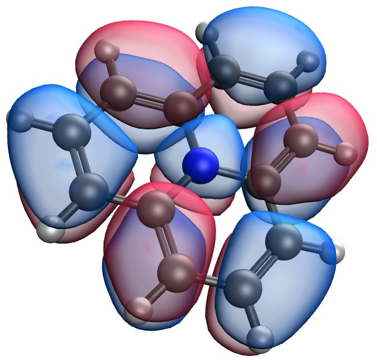

# Electron-pairing-based NOF for Multiplets

## Input

You can run a single point energy calculation using the `RUNTYP='ENERGY'` in the `&INPRUN` as in the following example:

:::{admonition} Example Input
~~~
 &INPRUN RUNTYP='ENERGY' MULT=1 ICHARG=0 ERITYP='FULL' /
 $DATA
 Water (H2O)
 cc-pVDZ
O  8.0  0.0000     0.0000    0.1173
H  1.0  0.0000     0.7572   -0.4692
H  1.0  0.0000    -0.7572   -0.4692
 $END
 &NOFINP IPNOF=8 /
~~~
:::

### `&INPRUN`

You can identify the following information inside the `&INPRUN` directive:
- `RUNTYP`: ENERGY for the single point NOF calculation
- `MULT`: The spin multiplicity.
- `ICHARG`: The charge of the system
- `ERITYP`:
  - `FULL`: For using four center integrals. (Scaling: $N^5$)
  - `RI`: For using the resolution of the identity approximation. (Scaling: $N^4$)
  - `MIX`: For automatically performin an RI calculation followed by a restart with FULL.  

### `$DATA`

You can identify the following information inside the `$DATA` block of this example:
- `title`: Water (H2O)
- `basis name`: cc-pVDZ
- `XYZ geometry`: Notice that the atomic number of each atom is indicated.

### `&NOFINP`

You can identify the following information inside the `&NOFINP` directive:
- `IPNOF`: 5 (PNOF5) | 7 (PNOF7) | 8 (GNOF)

## Visualization

```{margin} Article
[`Theor. Chem. Acc. 132(2), 1298 (2013).`](https://doi.org/10.1007/s00214-012-1298-4)
```

By default the code will output a `file.mld` that you can visualize with MOLDEN, and a `file.fchk` that you can open with many softwares such as Avogadro and IQmol, allowing to visualize the natural orbitals.


## Theory

### Electron-pairing-based NOF for Multiplets

```{margin} Article
[`Phys. Rev. A 100(3), 032508 (2019).`](https://doi.org/10.1103/PhysRevA.100.032508)
```

The non-relativistic electronic energy can be written as an explicit functional of the 1- and 2-order reduced density matrices (RDM)

$$E_{el}[\Gamma,D]=\sum_{ik}\Gamma_{ki}h_{ki}+\sum_{ijkl}D_{kl,ij}\langle kl|ij\rangle$$
    
where, if there is no any dependence on spin coordinates, then RDMs correspond to a mixed quantum state (ensemble) that allows all possible spin projections for a given total spin quantum number S.

$$
\Gamma_{ki}={\displaystyle \dfrac{1}{2S+1}{\textstyle {\displaystyle \sum_{M_{s}=-S}^{S}}}}\left\langle SM_{s}\right|\hat{a}_{k}^{\dagger}\hat{a}_{i}\left|SM_{s}\right\rangle
$$

$$
D_{kl,ij}={\displaystyle {\textstyle {\displaystyle \dfrac{1}{2\left(2S+1\right)}\sum_{M_{s}=-S}^{S}}}}\left\langle SM_{s}\right|\hat{a}_{k}^{\dagger}\hat{a}_{l}^{\dagger}\hat{a}_{j}\hat{a}_{i}\left|SM_{s}\right\rangle
$$
 
In practical applications, we approximate the 2RDM in terms of the occupation numbers, so this leads to an approximate NOF, namely

$$
E_{el}[\left\{ n_{i},\phi_{i}\right\}]=\sum\limits _{i}n_{i}\mathcal{H}_{ii}+\sum\limits _{ijkl}D[n_{i},n_{j},n_{k},n_{l}]\left\langle kl|ij\right\rangle
$$

In our electron-pair-based NOF the orbital space is divided into disjoint orbital subspaces. This allows us to conserve correct spin symmetry, both total spin and spin projection. Also, since the spin-restricted formalism can be employed even for S>0, the formula to compute energy gradients holds. Then it is straighforward to compute equilibrium geometries of non-singlet systems. See details at PRA 100, 032508 (2019) and "Analytic gradients for spin multiplets in natural orbital functional theory" (available also in arXiv:2005.02333 [physics.chem-ph]). In general, the NOF for spin-multiplets can be written as

$$
E=\sum\limits _{g=1}^{\frac{\mathrm{N_{II}}}{2}}E_{g}+\sum_{g=\frac{\mathrm{N_{II}}}{2}+1}^{\mathrm{N}_{\Omega}}\mathcal{H}_{gg}+\sum\limits _{f,g=1;f\neq g}^{\mathrm{N}_{\Omega}}E_{fg}
$$

$$
E_{g}=2\sum\limits _{p\in\Omega_{g}}n_{p}\mathcal{H}_{pp}+\sum\limits _{q,p\in\Omega_{g}}\Pi_{qp}\mathcal{K}_{pq}\,,\;\Omega{}_{g}\in\Omega_{\mathrm{II}}
$$

$$
E_{fg}=\sum\limits _{p\in\Omega_{f}}\sum\limits _{q\in\Omega_{g}}\left[n_{q}n_{p}\left(2\mathcal{J}_{pq}-\mathcal{K}_{pq}\right)-\Phi_{q}\Phi_{p}\mathcal{K}_{pq}\right]
$$

DoNOF contains several approximations that lead to the NOFs named as PNOFi [i=3-7] (in the input file we choose one or another by setting IPNOF=i). For more info see IJQC 113, 620 (2013), and also the references given below.

### PNOF5

```{margin} Article
[`J. Chem. Phys. 134(16), 164102 (2011).`](https://doi.org/10.1063/1.3582792)
```

PNOF5 is an independent-pair model. It is a pure N-representable NOF, since it corresponds to an APSG wavefunction with fixed phases (see JCP 139, 234109, 2013).

$$
E_{el}^{pnof5}={\displaystyle \sum\limits _{g=1}^{\mathrm{N}/2} E_{g}}+{\displaystyle \sum\limits _{f\neq g}^{\mathrm{N}/2}}E_{fg}
$$
$$
E_{fg}={\displaystyle \sum\limits _{p\in\Omega_{f}}\sum\limits _{q\in\Omega_{g}}}\left[n_{q}n_{p}\left(2\mathcal{J}_{pq}-\mathcal{K}_{pq}\right)\right]
$$
$$
E_{g}={\displaystyle \sum\limits _{p\in\Omega_{g}}}n_{p}\left(2\mathcal{H}_{pp}+\mathcal{J}_{pp}\right)+{\displaystyle \sum\limits _{q,p\in\Omega_{g},q\neq p}}\Pi_{qp}^{g}\mathcal{L}_{pq}    
$$
$$
\begin{array}{c}\\\Pi_{qp}^{g}=\left\{ \begin{array}{cc}-\sqrt{n_{q}n_{p}}\,, & p=g\textrm{ or }q=g\\+\sqrt{n_{q}n_{p}}\,, & p,q>\mathrm{N}/2\end{array}\right.\;,\qquad\delta_{q\Omega_{g}}=\begin{cases}1, & q\in\Omega_{g}\\0, & q\notin\Omega_{g}\end{cases}\end{array}
$$

### PNOF6

```{margin} Article
[`M. Piris, J. Chem. Phys. 141(4), 044107 (2014).`](https://doi.org/10.1063/1.4890653)
```

In the case of PNOF6, the only difference with respect to PNOF5 relies on the interaction between electrons that belong to different electron pairs. For PNOF6 this interaction is defined as

$$
E_{fg}={\displaystyle \sum\limits _{p\in\Omega_{f}}\sum\limits _{q\in\Omega_{g}}}E_{pq}^{int}={\displaystyle \sum\limits _{p\in\Omega_{f}}\sum\limits _{q\in\Omega_{g}}}\left[\left(n_{q}n_{p}-\Delta_{qp}\right)\left(2\mathcal{J}_{pq}-\mathcal{K}_{pq}\right)+\Pi_{qp}\mathcal{L}_{pq}\right]
$$

where

$$
\begin{array}{cc|cc|cc}\Delta_{qp} &  & \Pi_{qp} &  &  & Orbitals\\\hline e^{-2S}h_{q}h_{p} &  & -e^{-S}\left(h_{q}h_{p}\right)^{\frac{1}{2}} &  &  & q\leq F,p\leq F\\{\frac{\gamma_{q}\gamma_{p}}{S_{\gamma}}} &  & -\Pi_{qp}^{\gamma} &  &  &\begin{array}{c}q\leq F,p>F\\q>F,p\leq F\end{array}\\e^{-2S}n_{q}n_{p} &  & e^{-S}\left(n_{q}n_{p}\right)^{\frac{1}{2}} &  &  &q>F,p>F\end{array}
$$

$$
\begin{array}{c}\gamma_{p}=n_{p}h_{p}+\alpha_{p}^{2}-\alpha_{p}S_{\alpha}\\\alpha_{p}=\begin{cases}e^{-S}h_{p}\,, & p\leq F\\e^{-S}n_{p}\,, & p>F\end{cases}\\\Pi_{qp}^{\gamma}=\left(n_{q}h_{p}+{\displaystyle \frac{\gamma_{q}\gamma_{p}}{S_{\gamma}}}\right)^{\frac{1}{2}}\left(h_{q}n_{p}+{\frac{\gamma_{q}\gamma_{p}}{S_{\gamma}}}\right)^{\frac{1}{2}}\\S={\displaystyle\sum_{q=F+1}^{F+FN_{c}}}n_{q},\quad S_{\alpha}={\sum_{q=F+1}^{F+FN_{c}}}\alpha_{q},\quad S_{\gamma}={\sum_{q=F+1}^{F+FN_{c}}}\gamma_{q}\end{array}
$$

### PNOF7 

```{margin} Articles
[`Phys. Rev. Lett. 119(6), 063002 (2017).`](https://doi.org/10.1103/PhysRevLett.119.063002)

[`Eur. Phys. J. B 91(6), 109 (2018).`](https://doi.org/10.1140/epjb/e2018-90078-8)
```

PNOF7 introduces correlation between pairs of electrons through a term that explicitly contains particle-hole symmetry.

$$
    E_{el}^{pnof7}=E_{el}^{pnof5}+\sum\limits _{f\neq g}^{\mathrm{N}/2}\sum\limits _{p\in\Omega_{f}}\sum\limits_{q\in\Omega_{g}}\Pi_{qp}^{\Phi}\mathcal{L}_{pq}
$$
$$
\Pi_{qp}^{\Phi}=-\Phi_{q}\Phi_{p}
$$
$$
\Phi_{q}=\sqrt{n_{q}h_{q}}
$$
$$
h_{q}=1-n_{q}
$$

where {n} is the set of natural orbital occupation numbers.
    

### PNOF7s

```{margin} Article
[`Phys. Rev. A 98(2), 022504 (2018).`](https://doi.org/10.1103/PhysRevA.98.022504)
```

In order to choose PNOF7s in DoNOF, you must set IPNOF=7 Ista=1 in the $NOFINP section of your input file.

In the context of NOF-MP2 (see corresponding section), it is convenient to take into account the inter-pair static correction in the reference-used NOF from the outset, thus preventing the ONs and NOs from
suffering an inter-pair non-dynamic influence, however small, in the dynamic correlation domains. This led us to correlate the motion of electrons with parallel and opposite spins belonging to different subspaces as

$$
E_{fg}={\displaystyle \sum\limits _{p\in\Omega_{f}}\sum\limits _{q\in\Omega_{g}}}\left[n_{q}n_{p}\left(2\mathcal{J}_{pq}-\mathcal{K}_{pq}\right)-4\Phi^{2}_{q}\Phi^{2}_{p}\mathcal{K}_{pq}\right]
$$

So the resulting NOF, called static PNOF7 (PNOF7s), can be formulated analogously to PNOF7
    
$$
E_{el}^{pnof7}=E_{el}^{pnof5}+\sum\limits _{f\neq g}^{\mathrm{N}/2}\sum\limits _{p\in\Omega_{f}}\sum\limits_{q\in\Omega_{g}}\Pi_{qp}^{\Phi}\mathcal{L}_{pq}
$$
$$
\Pi_{qp}^{\Phi}=-4\Phi^{2}_{q}\Phi^{2}_{p}
$$

Note real orbitals are assumed, so exchange (K) and time-inversion-exchange (L) integrals are equivalent.


### GNOF

```{margin} Article
[`Phys. Rev. Lett. 127(23), 233001 (2021).`](https://doi.org/10.1103/PhysRevLett.127.233001)
```

In order to choose GNOF in DoNOF, you must set IPNOF=8 and Imod=0 in the $NOFINP section of your input file.

$$
    E_{el}^{gnof} = E^{intra} + E_{HF}^{inter} + E_{sta}^{inter} + E_{dyn}^{inter}
$$

The intra-pair component is formed by the sum of the energies of the pairs of electrons with opposite spins and the single-electron energies of the unpaired electrons, namely    
    
$$
    E^{intra} = {\displaystyle \sum\limits _{g=1}^{\mathrm{N}_{II} /2} E_g } 
    +  {\displaystyle \sum\limits _{g=\mathrm{N}_{II} /2 + 1}^{\mathrm{N}_{\Omega}} \mathcal{H}_{gg} }
$$    
$$
    E_g = \sum\limits _{p\in\Omega_g} n_p (2 \mathcal{H}_{pp}+\mathcal{J}_{pp}) + \sum\limits _{q,p\in\Omega_g,p\neq q} \Pi \left( n_q,n_p \right) \mathcal{L}_{pq}
$$
where

$$
    \Pi\left(n_q,n_p\right) = \sqrt{n_q n_p} \left(\delta_{q\Omega^{a}} \delta_{p\Omega^{a}} - \delta_{qg} - \delta_{pg} \right)
$$   

and H are the diagonal one-electron matrix elements of the kinetic energy and external potential operators. J and L are the Coulomb and exchange-time-inversion integrals, respectively. $\Omega^a$ denotes the subspace composed of orbitals above the level $N_{\Omega}$. 

The inter-pair Hartree-Fock (HF) term is
    
$$
    E _{HF}^{inter} = \sum\limits _{p,q=1}^{\mathrm{N}_B}\,'\, n_q n_p \left( 2\mathcal{J}_{pq}-\mathcal{K}_{pq} \right)
$$    
where K are the exchange integrals. The prime in the summation indicates that only the inter-subspace terms are taking into account. NB represents the number of basis functions considered. The inter-pair static component is written as

$$
 \begin{array}{c} E _{sta}^{inter} = -\left({ \displaystyle \sum _{p=1}^{\mathrm{N}_{\Omega}} \sum _{q=\mathrm{N}_{\Omega}+1}^{\mathrm{N}_{B}} + \sum _{p=\mathrm{N}_{\Omega}+1}^{\mathrm{N}_{B}} \sum _{q=1}^{\mathrm{N}_{\Omega}}}\right. \left.{\displaystyle  + \sum _{p,q=\mathrm{N}_{\Omega}+1}^{\mathrm{N}_{B}}}\right)' \Phi _{q} \Phi _{p} \\ \\ \mathcal{L}_{pq} - \:\dfrac{1}{2}\left({\displaystyle \sum\limits _{p=1}^{\mathrm{N _{II}}/2} \sum _{q=\mathrm{N _{II}}/2+1}^{\mathrm{N}_{\Omega}} + \sum _{p=\mathrm{N _{II}}/2+1}^{\mathrm{N} _{\Omega}}\sum\limits _{q=1}^{\mathrm{N_{II}}/2}}\right)' \Phi_q \Phi_p \mathcal{L}_{pq} \\ \\ {\displaystyle \:-\:\dfrac{1}{4} \sum _{p,q=\mathrm{N _{II}}/2+1}^{\mathrm{N}_{\Omega}}} \mathcal{K}_{pq}\end{array}
$$ 
where

$$ 
 \Phi _{p} = \sqrt{n _p h _{p}}\, , h_p = 1 -n_p. 
$$
Finally, the inter-pair dynamic energy can be conveniently expressed as 

$$
 \begin{array}{c} E_{dyn}^{inter}=\sum\limits _{p,q=1}^{\mathrm{N}_{B}}\,'\, \left[n_{q}^{d}n_{p}^{d} +\;\Pi\left(n_{q}^{d},n_{p}^{d}\right)\right] \left(1-\delta_{q\Omega^{b}_{II}}\delta_{p\Omega^{b}_{II}}\right)\mathcal{L}_{pq} \end{array}
$$

In this equation, $\Omega^b_{II}$ denotes the subspace composed of orbitals below the level $N_{II}/2$. The dynamic part of the occupation number $n_p$ is defined as

$$
   n_p^d = n_p . e^{-\left( \dfrac{h_g}{h_c} \right)^{2}}, \,\, p\in\Omega_g, \,\, h_c = 0.02 \sqrt{2}
$$

The maximum value of $n_p^d$ is around 0.012 in accordance with the Pulay’s criterion that establishes an occupancy deviation of approximately 0.01 with respect to 1 or 0 for a natural orbital to contribute to the dynamic correlation. Clearly, GNOF does not take into account dynamic correlation of the single electrons. Considering real spatial orbitals (L=K) and $n_p$ ~ $n_p^d$, it is not difficult to verify that the terms proportional to the product of the occupation numbers will cancel out, so that only those terms proportional to \Pi will contribute significantly to the energy.

### GNOFm

```{margin} Article
[`Phys. Rev. Lett. 134(20), 206401 (2025).`](https://doi.org/10.1103/PhysRevLett.134.206401)
```

In order to choose GNOFm in DoNOF, you must set IPNOF=8 and Imod=1 in the $NOFINP section of your input file.

$$
    E_{el}^{gnofm} = E^{intra} + E_{HF}^{inter} + E_{sta}^{inter} + E_{dyn}^{inter}
$$

The modification of GNOFm with respect to its predecessor GNOF stands in the correlation energy term between different electron pairs

$$
    E _{sta}^{inter} = \sum\limits _{p,q}^{\mathrm{N}_B}\,'\, \mathcal{K}_{pq}
$$ 

