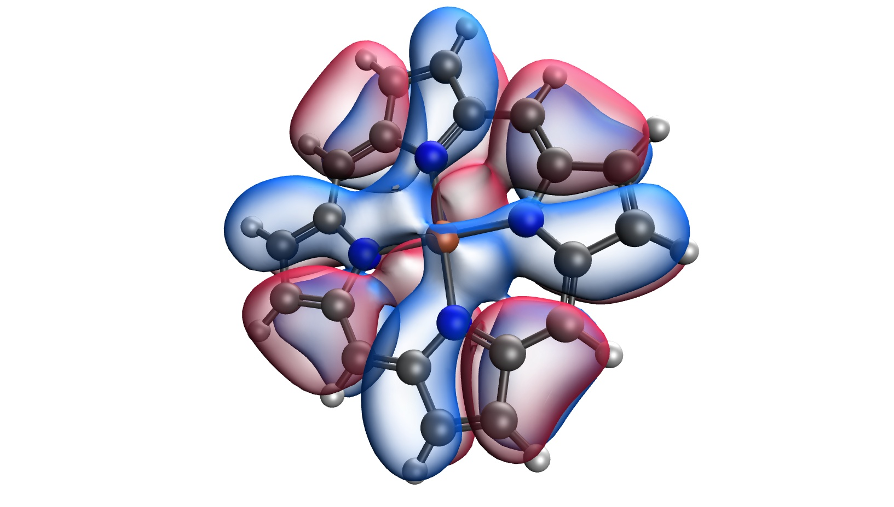

# DoNOF: Donostia Natural Orbital Functional Software

DoNOF is an open-source implementation of natural-orbital-functional-based methods for quantum chemistry.

The DoNOF computer program is designed to solve the energy
minimization problem of a natural-orbital-functional (NOF)
that describes the ground-state of an N-electron
system at absolute zero temperature. The program includes the NOFs developed
in the Donostia quantum chemistry group, namely PNOFi [i=1-8]. The
solution is established by optimizing the energy functional with respect to the
occupation numbers and to the natural orbitals, separately.

:::{admonition} Citation
:class: tip
M. Piris, I. Mitxelena, DoNOF: an open-source implementation of natural-orbital-functional-based methods for quantum chemistry”, 
Comp. Phys. Comm. 259, 107651 (2021)
[DOI:10.1016/j.cpc.2020.107651](https://doi.org/10.1016/j.cpc.2020.107651)
:::

